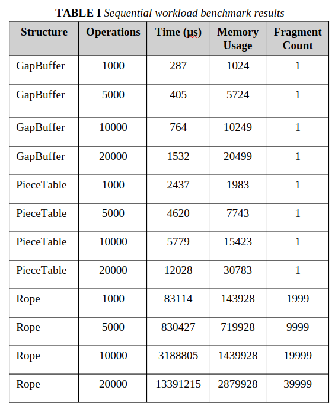
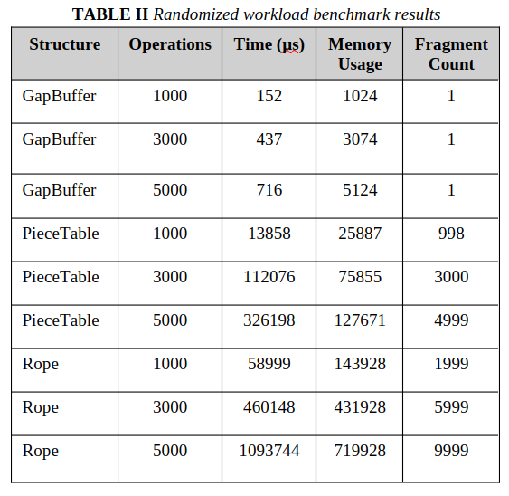
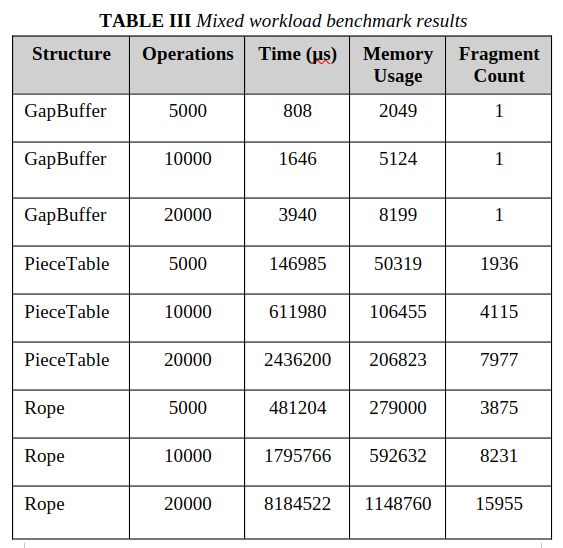

## Abstract
Text editor systems rely heavily on efficient internal text buffer architectures to support editing operations such as insertion, deletion, substring retrieval, and undo/redo management. Different text buffer data structures exhibit substantially different performance characteristics depending on editing workload patterns, memory behavior, and fragmentation tendencies. This paper presents a comparative experimental analysis of three widely recognized text buffer architectures: Gap Buffers, Piece Tables, and Rope data structures. Each structure was implemented from scratch in C++ within a unified benchmarking and validation framework supporting randomized editing workloads, undo/redo operations, fragmentation analysis, and memory usage evaluation. The experimental framework measures execution latency under sequential insertion workloads, random editing operations, and mixed editing scenarios while additionally tracking memory consumption and structural fragmentation metrics. Experimental results demonstrate that Gap Buffers perform efficiently under localized editing workloads due to their contiguous memory layout, while Piece Tables exhibit increased fragmentation under randomized editing patterns. Rope structures provide scalable editing behavior for larger text workloads but introduce additional structural overhead and balancing complexity. The findings highlight the importance of workload-aware buffer selection in editor system design and provide practical insights into the trade-offs associated with modern text editing architectures.

## Benchmark Results
 
